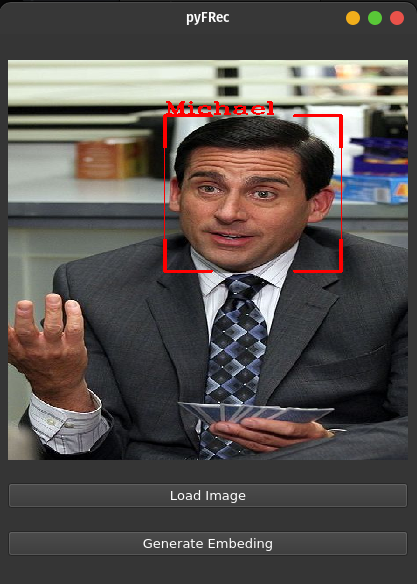
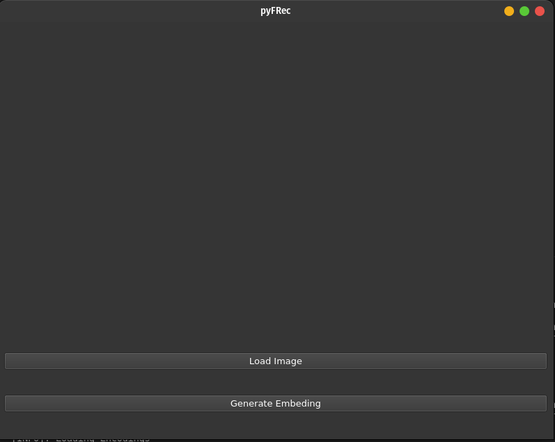

# pyFRec
The purpose of this repo is to provide a user friendly app for performing face recognition


## Install 


```bash
git clone https://github.com/danigarci1/face_recognition_ui.git
pip install -r requirements.txt

```

## Configuration

Use config.cfg to customize the running parameters
*General*
 - show : Whether to show the final result or not

*detector*
 - model_path : Path to face detector model
 - conf_threshold : Face detector threshold
 - from_video : Whether to run code from image or from video

*recognition*
 - model_path = Path to face recognition model
 - recognition_threshold = Face recognition threshold

*video*
 - camera_idx = Path to source when from_video=True

*image*
 - image_path = Path to source when from_video=False

## Faces collection
Place all the images in the assets/faces folder. Each folder should contain multiple images of each person. The name of the folder should be the name of the person.

## CLI usage

### 1. Generate the embeddings file
The embeddings file will be generated in assets/encodings

```
python save_embeddings.py
```

### 2. Run main file
Check the config.cfg for system configuration

```
python main.py
```


## GUI usage

```
python ui.py
```



